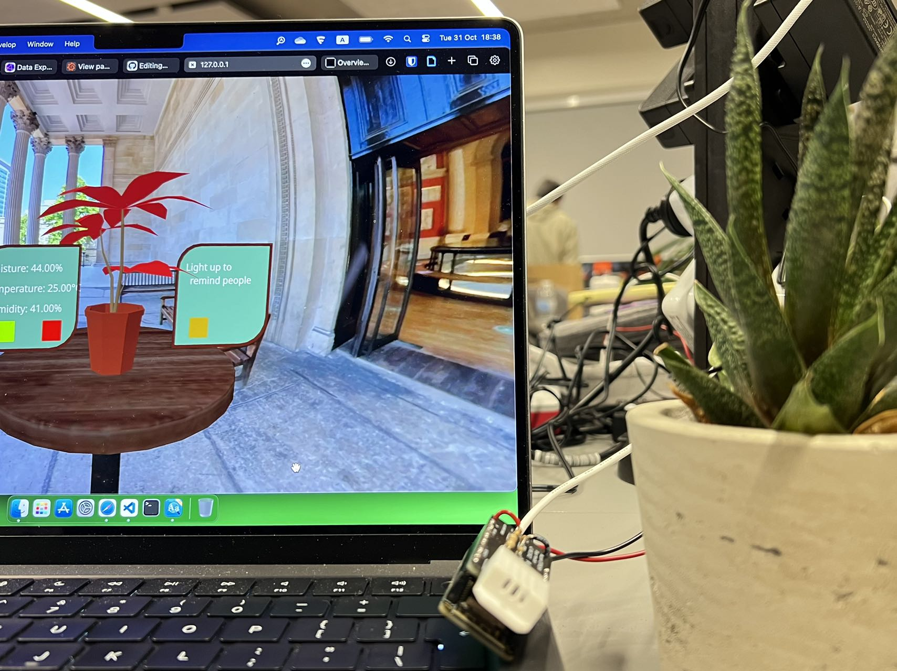

# CE_PlantMonitor

In this lesson, i build up an internet connected sensing installation. It will monitor the moisture of soil and you can check the status of the plant on a website showcasing the real-time data of the sensors.

    

