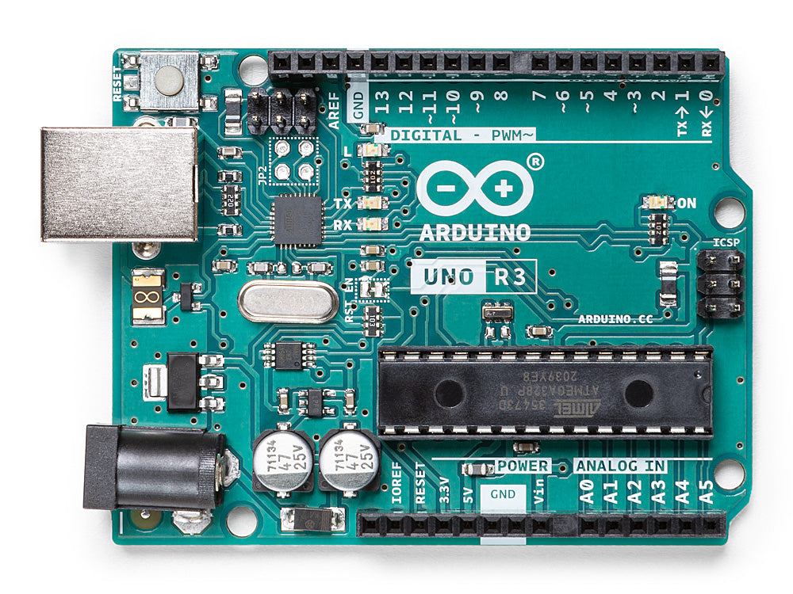
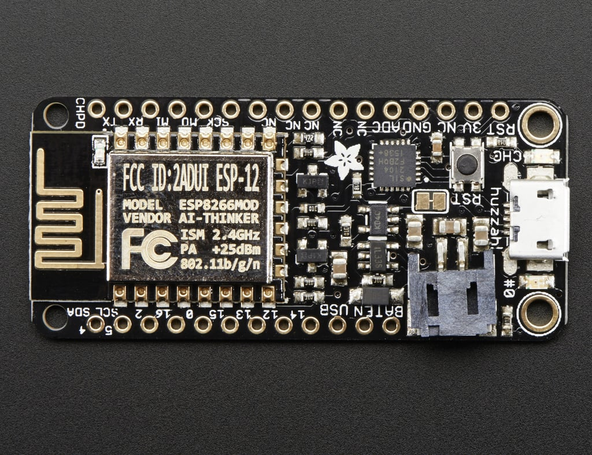
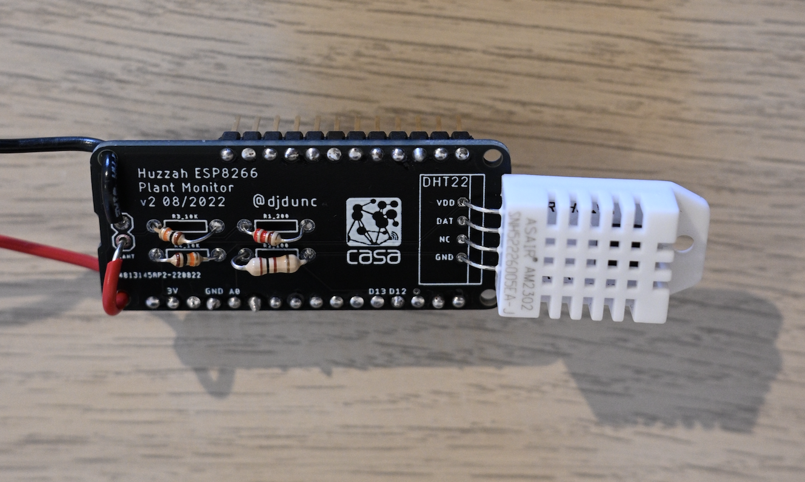
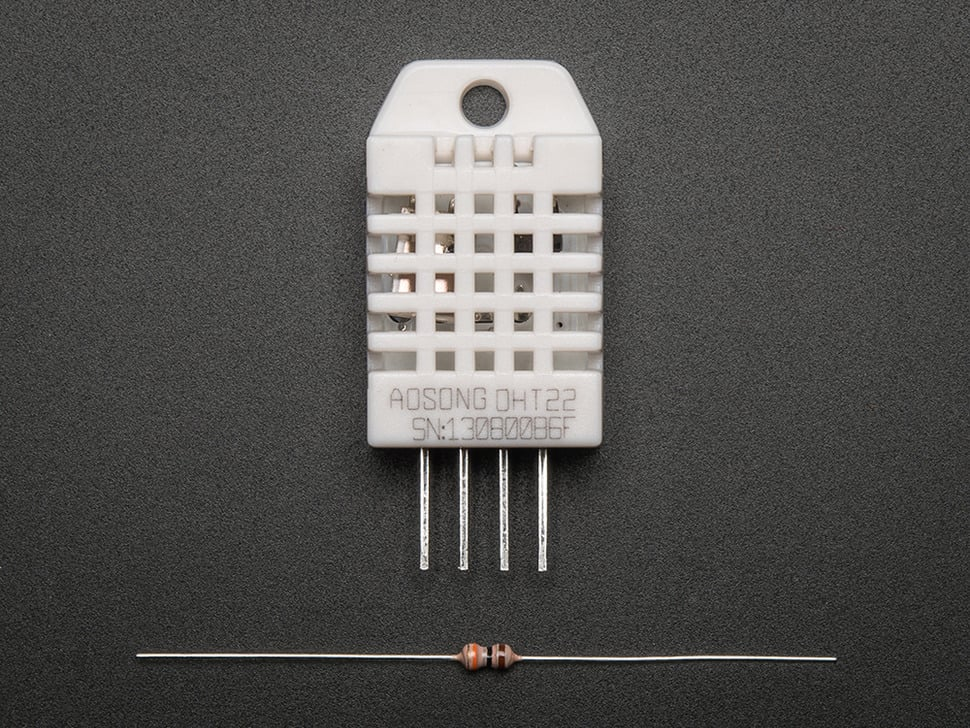
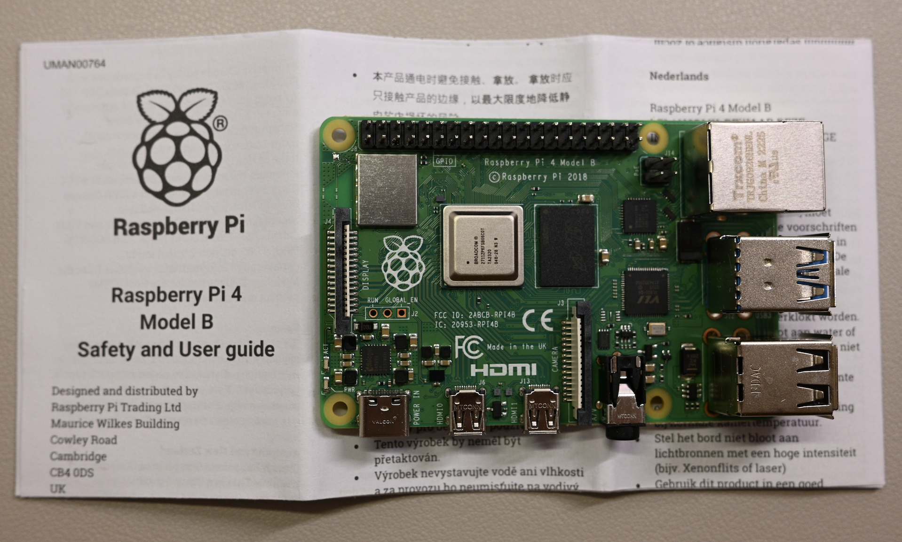
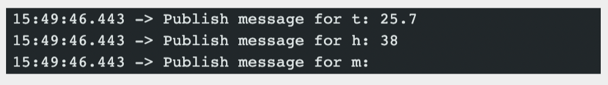
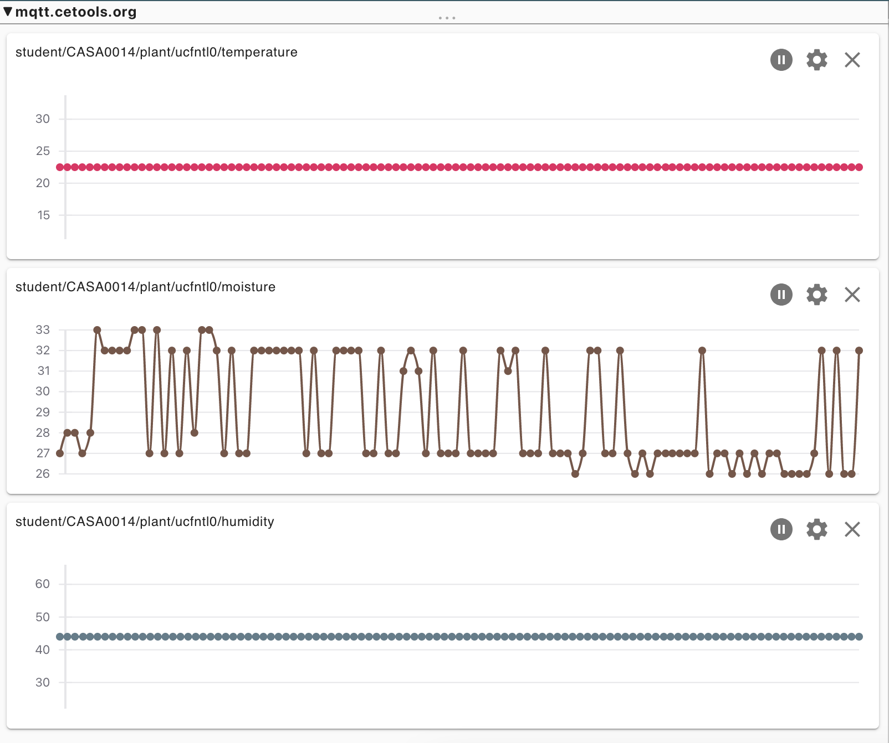
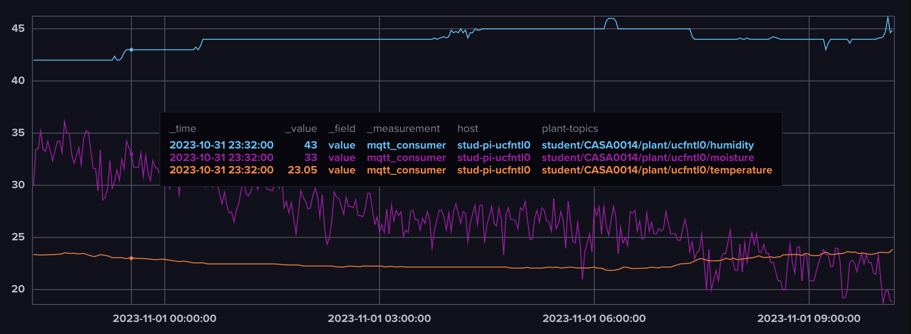
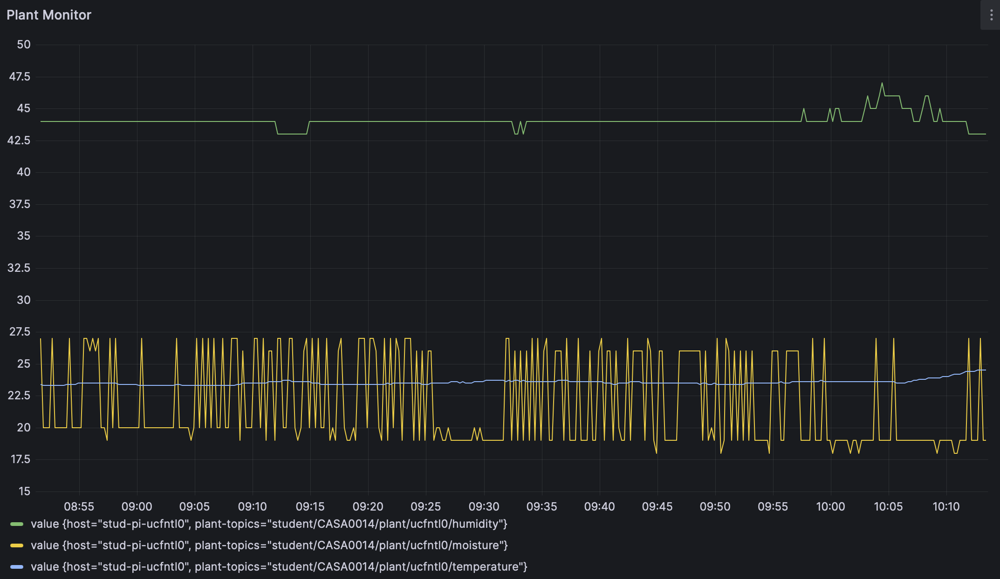

# CE_PlantMonitor

In this lesson, i build up an internet connected sensing installation. It will monitor the moisture of soil and you can check the status of the plant on a website showcasing the real-time data of the sensors.

<center>
  
</center>

The latest version with watering function. When the moisture is lower than certain number, the Red LED will be lighten up. You can press the button to watering the plant with the green led light at the same time.

<center>
  
</center>

## Parts List 😀
### 1. Microcontroller
**1.1 Arduino Uno**

Open the gate of *microcontroller*.

<center>
  
</center>

**1.2 Adafruit Feather HUZZAH ESP8266**
    
Main _controller_ in this plant monitor to sense, collect and upload plant moisture data.
<center>
  
</center>

### 2. Sensor

**2.1 Moisture Sensing Module**

This module is a print circuit board embedded with voltage divider part and moisture part which consists of two nails.

<center>
  
</center>

The diagram demonstrates the structure of the *Moisture Sensing Module*.

<center>
  
</center>


**2.2 DHT22 Temperature-humidity Sensor**

In this plant monitor, we embed our DHT22 senor on the PCB to keep the circuit for sensing clean and tidy.

<center>
  
</center>

### 3. Single-Board Computer
**Raspberry Pi 4 Model B**

Utilize a Raspberry Pi for setting up a database and visualizing data.

<center>
  
</center>


## Folder Structure

```none
Plant Monitor Project
├── Code (Write in Arduino IDE for sensing and mqtt connection)
│   ├── Demo (The Current Version of whole plant monitor)
│   │   ├── Demo.ino (Main Code)
│   │   ├── passwords.h (! You Need to Add Your Password File)
│   ├── Test (I save the sperate module script to test different function)
│   │   │   ├── ConnectToWifi
│   │   │   │   ├── ConnectToWifi.ino
│   │   │   │   ├── passwords.h (! You Need to Add Your Password File)
│   │   │   ├── GetTheTime
│   │   │   │   ├── GetTheTime.ino
│   │   │   │   ├── passwords.h (! You Need to Add Your Password File)
│   │   │   ├── MQTT
│   │   │   │   ├── MQTT.ino
│   │   │   │   ├── passwords.h (! You Need to Add Your Password File)
│   │   │   ├── testDHT22
│   │   │   │   ├── testDHT22.ino
│   │   │   ├── testMoisture
│   │   │   │   ├── testMoisture.ino
├── Links (Images for the description in README.md)
├── Model (3D Model for enclosure of the sensors and controller)
│   │   │   ├── 3D Model Sample.3dm (Model Sample Built in Rhino)
│   │   │   ├── Parametric Workflow.gh (To be continue...Grasshopper File for Model)
│   │   │   ├── Model For Print.stl (To be Continue...)
├── Website (Interactive web showing the plant status and control the button remotely)
│   │   │   ├── js
│   │   │   │   ├── custom-component.js (JS for functions executing after user click the button )
│   │   │   │   ├── mqtt-config.js (! You need to add your own password for mqtt !)
│   │   │   ├── resources (Models and 360 degree image)
│   │   │   │   ├── ...
│   │   │   ├── index.html (main code for web)
├── .gitignore (ignore the password file in the repository)
├── README.md (Brief intro of the project)


```

## Common Issues

**1. No moisture value**

<center>
  
</center>


  This mostly result from a extremly large resistance between two nails. 
    
For example, when you test the code at first, you may hold the two respectively with your hands, the voltage read by the analog pin is too small to return.

**2. Rasberry Pi SSH Connection**

The format for ssh connection is 

<u>"ssh {rasp pi username}@{rasp pi hostname}.local"</u>

The password is set up behind the username.

## Current Output

- Data In CE-Lab MQTT Broker From My Own Topic
<center>
  
</center>

- Data In InfluxDB Dashboard
<center>
  
</center>

- Data Visualization in Grafana Dashboard

<center>
  
</center>


## Future

### 1. Build Website Interaction

Set up web connection to mqtt and interactive with a led light to remind people around the plant through sending message to a newly built topic.

Collect and visualize the data on the same website. Analyse the former status of plant, compute the last time someone watering plant. 

<center>
  
</center>

### 2. Change the Watering Method with automatic control

Switching from top watering to bottom watering and adding an automatic control module that allows people to operate it from the website above. 

Bottom watering can prevent the topsoil from becoming too compact, allowing water to flow smoothly and avoiding waterlogging, which can attract many mosquitoes.

<center>
  
</center>

### 3. Parametric model for 3d Enclosure

Estabilish a parameteric model that fits various pot sizes. With combination of 3D printing tech, we can finish the 3D enclosure models quickly.

The general workflow for the parametric model:

- Input: Port Shape, Port Size, Depth of the Gap

- Output: STL Format Model (For 3D Modelling)

A simple demo in Rhino.

<center>
  
</center>

## Lisence
